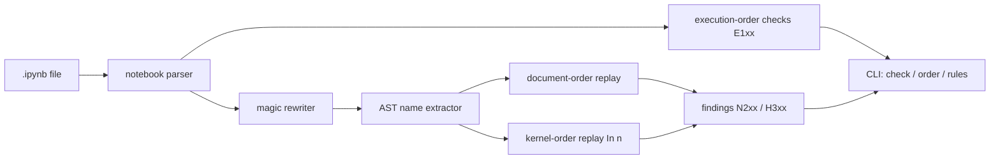

# cellvet

[English](README.md) | [中文](README.zh.md) | [日本語](README.ja.md)

[](LICENSE) [](CHANGELOG.md) [](pyproject.toml)  [](CONTRIBUTING.md)

**Jupyter ノートブックの隠れ状態バグ——実行順の乱れ、未定義の名前、再現不能なセル——を検出するオープンソースの静的解析器。カーネル不要、依存ゼロ。**


```bash
git clone https://github.com/JaydenCJ/cellvet && cd cellvet && pip install -e .
```

> **プレリリース：** cellvet はまだ PyPI に公開されていません。最初のリリースまでは [JaydenCJ/cellvet](https://github.com/JaydenCJ/cellvet) をクローンし、リポジトリ直下で `pip install -e .` を実行してください。

## なぜ cellvet？

古いカーネル状態のおかげでしか動かないノートブックは、データサイエンティストなら誰でも一度は出荷しています。3 つ*下*のセルで定義された `df` を読むセル、再実行されないままの `del`、後から再代入された変数で計算された結果。ファイルは正常に見え、保存された出力も本物——それでも *Restart & Run All* で爆発します。フォーマッタや出力除去ツールは状態を完全に無視し、ノートブック向けリンタは各セルを孤立した Python として検査し、実行ベースの検証器は Jupyter 一式と数分の実行時間を要求します。cellvet は `.ipynb` を静的に読み——`ast` + `json` のみ、カーネルなし、一切実行せず——ノートブックを二度リプレイします。一度は文書順（フレッシュな実行が得るもの）、一度は記録された `In [n]` 順（あなたのカーネルが実際にやったこと）。この 2 つのリプレイの差分こそ、世に出てしまうバグそのものです。

|  | cellvet | nbQA (+flake8) | nbstripout | nbval |
|---|---|---|---|---|
| 実行順の乱れを検出 | 可 | 不可 | 不可（証拠ごと削除） | 不可 |
| フレッシュ実行での未定義名 | 可 | 部分的（F821、カーネル順の文脈なし） | 不可 | 全再実行でのみ |
| 古い束縛の検出（後で再定義された値で実行済み） | 可 | 不可 | 不可 | 不可 |
| どの古い実行がバグを隠したかを説明 | 可 | 不可 | 不可 | 不可 |
| 検査に Jupyter カーネル／ランタイムが必要 | 不要 | 不要 | 不要 | 必要 |
| ランタイム依存 | 0 | 3 | 1 | 5 |

<sub>依存数は 2026-07 時点で各パッケージが PyPI に宣言するランタイム要件：nbqa 1.9（ipython、tokenize-rt、tomli）、nbstripout 0.8（nbformat）、nbval 0.11（pytest、jupyter-client、nbformat、ipykernel、coverage）。cellvet の数字は [pyproject.toml](pyproject.toml) の `dependencies = []` です。</sub>

## 機能

- **二重リプレイ解析** —— ノートブックを文書順*と*記録された実行順の両方でシミュレート。`N202` のような指摘は、フレッシュ実行が壊れることだけでなく、どの古い実行があなたの環境で正常に見せていたかまで教えます。
- **本物の Python スコープ** —— 関数ローカルは CPython のシンボルテーブルと同様に事前走査、関数内の呼び出し時読み取りはノートブック全体に対して検査、内包表記スコープとセイウチ演算子の漏出は PEP 572 準拠、クラス本体とメソッドの可視性もモデル化——`def` セルが誤検知の山になりません。
- **マジック構文対応** —— `%time`、`%%capture out`、`files = !ls`、`df.head?` は（行番号を保ったまま）書き換えられ、パース失敗になりません。`%%bash` のような不透明セルマジックは誤読せず解析対象外に。
- **メタデータ検査はおまけ付き** —— 順序の乱れ、未実行セル、番号の飛び、重複番号は、コードがパースできないセルでも、セルのメタデータだけで捕捉。
- **pre-commit 即応** —— エラーで終了コード 1（`--strict` なら任意の指摘で）、`--select`/`--ignore` はルール ID・ファミリで指定、エディタやボット向け JSON 出力、`.ipynb_checkpoints` を飛ばす再帰探索。
- **何も実行しない、絶対に** —— 信頼できないノートブックにも安全：カーネルなし、ノートブックコードの import なし、ネットワークなし、ランタイム依存ゼロ。

## クイックスタート

インストール：

```bash
git clone https://github.com/JaydenCJ/cellvet && cd cellvet && pip install -e .
```

同梱の例——古いカーネル状態でしか「動かなかった」ノートブック——を検査します：

```bash
cellvet check examples/stale_state.ipynb
```

```text
examples/stale_state.ipynb
  notebook: E103 execution-count-gap [info]
    execution counts jump over In [5]; cells were re-run or deleted after running, so the session held state this file no longer shows
  cell 1, line 1: N202 defined-after-use [error]
    'revenue' is used here but only defined in cell 2 (In [2]), which comes later in the notebook; it worked in your session only because cell 2 (In [2]) had already run
  cell 4, line 1: H301 order-dependent-binding [warning]
    'tax_rate' comes from cell 3 (In [1]) on a fresh run, but this cell actually ran against the value from cell 5 (In [3]); its saved output may not reproduce
  cell 6, line 1: N201 undefined-name [error]
    'build_report' is never defined anywhere in the notebook; a fresh run raises NameError

3 errors, 5 warnings, 1 info in 1 notebook
```

（出力は実際の実行から転載。紙幅の都合で 2 件目の N202 エラーと E101/E102 の警告 4 件を省略。）2 つの順序を並べて見るには：

```bash
cellvet order examples/stale_state.ipynb
```

```text
examples/stale_state.ipynb — 6 code cells, 5 executed
 doc | In [#] | first line
   1 | 4      | mean_revenue = statistics.mean(revenue)
   2 | 2      | import statistics
   3 | 1      | tax_rate = 0.10
   4 | 6      | total = mean_revenue * (1 + tax_rate)
   5 | 3      | tax_rate = 0.25
   6 | -      | report = build_report(revenue, total)
execution order differs from document order
```

## ルール

例と修正方法つきの完全なリファレンス：[`docs/rules.md`](docs/rules.md)。

| ID | 名前 | 深刻度 | 意味 |
|---|---|---|---|
| E101 | out-of-order-execution | warning | セルが表示と異なる順序で実行された |
| E102 | never-executed-cell | warning | 他は実行済みなのにこのコードセルは未実行 |
| E103 | execution-count-gap | info | 実行後にセルが再実行・削除された |
| E104 | duplicate-execution-count | warning | 別セッションから貼り付けられたセル |
| N201 | undefined-name | error | フレッシュ実行で NameError：どこにも定義なし |
| N202 | defined-after-use | error | フレッシュ実行で NameError：定義は下方 |
| N203 | use-after-delete | error | フレッシュ実行で NameError：上方に `del` |
| H301 | order-dependent-binding | warning | フレッシュ実行では決して見ない値で実行された |
| P001 | unparsable-cell | warning | 有効な Python でない；名前解析はスキップ |
| W401 | star-import | info | `import *` が未定義名検査を抑制 |

## pre-commit ゲート

cellvet は標準ライブラリのみの単一コマンドなので、ローカルフックの設定に追加リポジトリは不要です：

```yaml
repos:
  - repo: local
    hooks:
      - id: cellvet
        name: cellvet
        entry: cellvet check
        language: system
        files: \.ipynb$
```

終了コード：`0` クリーン（警告は許容）、`1` エラー検出（`--strict` なら任意の指摘で）、`2` 入力が不正。典型的な CI の一行：`cellvet check notebooks/ --strict --ignore E103`。

## 検証

このリポジトリは CI を持ちません。上記の主張はすべてローカル実行で検証されています。このリポジトリのチェックアウトから再現できます：

```bash
pip install -e '.[dev]' && pytest && bash scripts/smoke.sh
```

出力（実際の実行から転載、`...` で省略）：

```text
90 passed in 1.18s
...
[order] execution order differs from document order
SMOKE OK
```

## アーキテクチャ



## ロードマップ

- [x] 実行順検査、二重リプレイ名前フロー解析、マジック書き換え、ルール選択、text/JSON 出力、`order`・`rules` コマンド（v0.1.0）
- [ ] PyPI 公開（`pip install cellvet`）
- [ ] `cellvet fix --reorder`：トポロジカルソートしたセル順の提案
- [ ] セル単位の抑制コメント（`# cellvet: ignore[N202]`）
- [ ] ノートブック横断解析：`%run` と papermill 流のパラメータセル

完全なリストは [open issues](https://github.com/JaydenCJ/cellvet/issues) を参照してください。

## コントリビュート

コントリビュート歓迎——[good first issue](https://github.com/JaydenCJ/cellvet/issues?q=is%3Aissue+is%3Aopen+label%3A%22good+first+issue%22) から始めるか、[discussion](https://github.com/JaydenCJ/cellvet/discussions) を開いてください。開発環境の構築は [CONTRIBUTING.md](CONTRIBUTING.md) を参照。

## ライセンス

[MIT](LICENSE)
