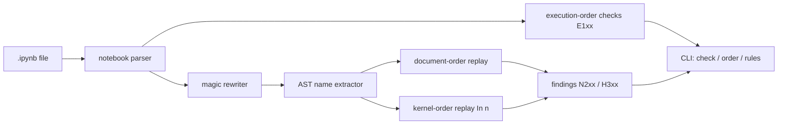

# cellvet

[English](README.md) | [中文](README.zh.md) | [日本語](README.ja.md)

[](LICENSE) [](CHANGELOG.md) [](pyproject.toml)  [](CONTRIBUTING.md)

**Open-source static analyzer that detects hidden-state bugs in Jupyter notebooks — out-of-order execution, undefined names, unreproducible cells — with no kernel and no dependencies.**


```bash
git clone https://github.com/JaydenCJ/cellvet && cd cellvet && pip install -e .
```

> **Pre-release:** cellvet is not yet published to PyPI. Until the first release, clone [JaydenCJ/cellvet](https://github.com/JaydenCJ/cellvet) and run `pip install -e .` from the repository root.

## Why cellvet?

Every data scientist has shipped a notebook that only ran because of stale kernel state: a cell that reads `df` defined three cells *below* it, a `del` that never re-ran, a result computed against a variable that was later redefined. The file looks fine, the saved outputs are real — and *Restart & Run All* explodes. Formatters and output-strippers ignore state entirely, notebook linters check each cell as isolated Python, and execution-based validators need the full Jupyter stack plus minutes of runtime. cellvet reads the `.ipynb` file statically — pure `ast` + `json`, no kernel, nothing executed — and replays the notebook twice: once in document order (what a fresh run gets) and once in the recorded `In [n]` order (what your kernel actually did). The difference between those two replays is exactly the class of bug that ships.

|  | cellvet | nbQA (+flake8) | nbstripout | nbval |
|---|---|---|---|---|
| Detects out-of-order execution | Yes | No | No (deletes the evidence) | No |
| Undefined names on a fresh run | Yes | Partial (F821, no kernel-order context) | No | Only by re-running everything |
| Stale-binding detection (ran against a later-redefined value) | Yes | No | No | No |
| Explains which stale execution masked the bug | Yes | No | No | No |
| Needs a Jupyter kernel / runtime to check | No | No | No | Yes |
| Runtime dependencies | 0 | 3 | 1 | 5 |

<sub>Dependency counts are the declared runtime requirements on PyPI as of 2026-07: nbqa 1.9 (ipython, tokenize-rt, tomli), nbstripout 0.8 (nbformat), nbval 0.11 (pytest, jupyter-client, nbformat, ipykernel, coverage). cellvet's count is `dependencies = []` in [pyproject.toml](pyproject.toml).</sub>

## Features

- **Two-replay analysis** — the notebook is simulated in document order *and* in recorded execution order; findings like `N202` tell you not just that a fresh run breaks, but which stale execution made it look fine on your machine.
- **Real Python scoping** — function locals are pre-scanned like CPython's symbol table, call-time reads inside functions are checked against the whole notebook, comprehension scopes and walrus leakage behave per PEP 572, and class-body vs. method visibility is modeled — so `def` cells don't drown you in false positives.
- **Magic-aware** — `%time`, `%%capture out`, `files = !ls`, and `df.head?` are rewritten (line counts preserved) instead of breaking the parse; opaque cell magics like `%%bash` are excluded rather than misread.
- **Metadata checks for free** — out-of-order counts, never-executed cells, count gaps, and duplicate counts are caught from cell metadata alone, even in cells whose code can't be parsed.
- **Pre-commit ready** — exit code 1 on errors (any finding with `--strict`), `--select`/`--ignore` by rule ID or family, JSON output for editors and bots, recursive discovery that skips `.ipynb_checkpoints`.
- **Nothing is executed, ever** — safe on untrusted notebooks: no kernel, no imports of notebook code, no network, zero runtime dependencies.

## Quickstart

Install:

```bash
git clone https://github.com/JaydenCJ/cellvet && cd cellvet && pip install -e .
```

Check the bundled example of a notebook that "worked" only via stale kernel state:

```bash
cellvet check examples/stale_state.ipynb
```

```text
examples/stale_state.ipynb
  notebook: E103 execution-count-gap [info]
    execution counts jump over In [5]; cells were re-run or deleted after running, so the session held state this file no longer shows
  cell 1, line 1: N202 defined-after-use [error]
    'revenue' is used here but only defined in cell 2 (In [2]), which comes later in the notebook; it worked in your session only because cell 2 (In [2]) had already run
  cell 4, line 1: H301 order-dependent-binding [warning]
    'tax_rate' comes from cell 3 (In [1]) on a fresh run, but this cell actually ran against the value from cell 5 (In [3]); its saved output may not reproduce
  cell 6, line 1: N201 undefined-name [error]
    'build_report' is never defined anywhere in the notebook; a fresh run raises NameError

3 errors, 5 warnings, 1 info in 1 notebook
```

(Output copied from a real run; a second N202 error and four E101/E102 warnings trimmed for width.) See the two orders side by side:

```bash
cellvet order examples/stale_state.ipynb
```

```text
examples/stale_state.ipynb — 6 code cells, 5 executed
 doc | In [#] | first line
   1 | 4      | mean_revenue = statistics.mean(revenue)
   2 | 2      | import statistics
   3 | 1      | tax_rate = 0.10
   4 | 6      | total = mean_revenue * (1 + tax_rate)
   5 | 3      | tax_rate = 0.25
   6 | -      | report = build_report(revenue, total)
execution order differs from document order
```

## Rules

Full reference with examples and fixes: [`docs/rules.md`](docs/rules.md).

| ID | Name | Severity | Means |
|---|---|---|---|
| E101 | out-of-order-execution | warning | cells were run in a different order than shown |
| E102 | never-executed-cell | warning | a code cell was skipped while others ran |
| E103 | execution-count-gap | info | cells were re-run or deleted after running |
| E104 | duplicate-execution-count | warning | cells pasted in from a different session |
| N201 | undefined-name | error | fresh run raises NameError: never defined |
| N202 | defined-after-use | error | fresh run raises NameError: defined further down |
| N203 | use-after-delete | error | fresh run raises NameError: `del` above |
| H301 | order-dependent-binding | warning | cell ran against a value a fresh run never sees |
| P001 | unparsable-cell | warning | not valid Python; name analysis skipped |
| W401 | star-import | info | `import *` suppresses undefined-name checks |

## Pre-commit gate

cellvet is a single stdlib-only command, so wiring it as a local hook needs no extra repo:

```yaml
repos:
  - repo: local
    hooks:
      - id: cellvet
        name: cellvet
        entry: cellvet check
        language: system
        files: \.ipynb$
```

Exit codes: `0` clean (warnings allowed), `1` errors found (or any finding with `--strict`), `2` unusable input. Typical CI line: `cellvet check notebooks/ --strict --ignore E103`.

## Verification

This repository ships no CI; every claim above is verified by local runs. Reproduce them from a checkout of this repository:

```bash
pip install -e '.[dev]' && pytest && bash scripts/smoke.sh
```

Output (copied from a real run, truncated with `...`):

```text
90 passed in 1.18s
...
[order] execution order differs from document order
SMOKE OK
```

## Architecture



## Roadmap

- [x] Execution-order checks, two-replay name-flow analysis, magic rewriting, rule selection, text/JSON output, `order` and `rules` commands (v0.1.0)
- [ ] PyPI release with `pip install cellvet`
- [ ] `cellvet fix --reorder`: propose a topologically sorted cell order
- [ ] Per-cell suppression comments (`# cellvet: ignore[N202]`)
- [ ] Cross-notebook analysis for `%run` and papermill-style parameter cells

See the [open issues](https://github.com/JaydenCJ/cellvet/issues) for the full list.

## Contributing

Contributions are welcome — start with a [good first issue](https://github.com/JaydenCJ/cellvet/issues?q=is%3Aissue+is%3Aopen+label%3A%22good+first+issue%22) or open a [discussion](https://github.com/JaydenCJ/cellvet/discussions). See [CONTRIBUTING.md](CONTRIBUTING.md) for the development setup.

## License

[MIT](LICENSE)
