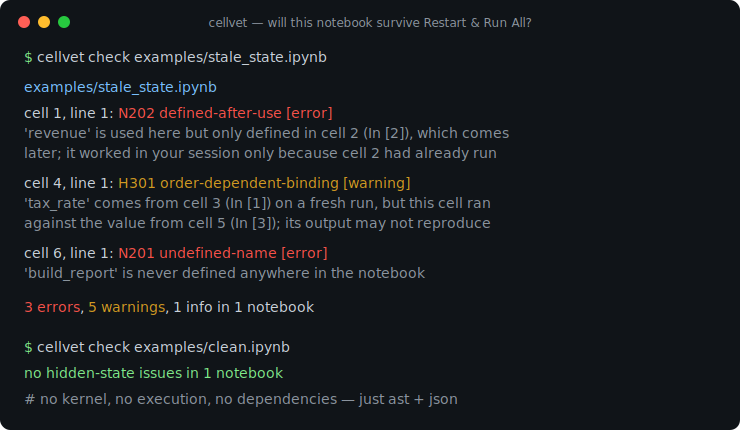
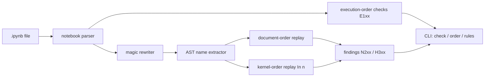

# cellvet

[English](README.md) | [中文](README.zh.md) | [日本語](README.ja.md)

[](LICENSE) [](CHANGELOG.md) [](pyproject.toml)  [](CONTRIBUTING.md)

**开源的 Jupyter notebook 隐藏状态静态分析器——乱序执行、未定义名称、不可复现的 cell——不需要 kernel，零依赖。**



```bash
git clone https://github.com/JaydenCJ/cellvet && cd cellvet && pip install -e .
```

> **预发布：** cellvet 尚未发布到 PyPI。在首个正式版之前，请克隆 [JaydenCJ/cellvet](https://github.com/JaydenCJ/cellvet) 并在仓库根目录执行 `pip install -e .`。

## 为什么选 cellvet？

每个数据科学家都发布过只靠陈旧 kernel 状态才能跑通的 notebook：某个 cell 读取的 `df` 定义在它*下方*三个 cell，一个从未重新执行的 `del`，或是基于后来被重新赋值的变量算出的结果。文件看起来没问题，保存的输出也是真的——可 *Restart & Run All* 直接爆炸。格式化器和输出清理工具完全无视状态，notebook linter 把每个 cell 当作孤立的 Python 检查，而基于执行的校验器需要完整的 Jupyter 全家桶外加数分钟运行时间。cellvet 纯静态地读取 `.ipynb` 文件——只用 `ast` + `json`，没有 kernel，不执行任何代码——并把 notebook 重放两遍：一遍按文档顺序（全新运行会得到的），一遍按记录的 `In [n]` 顺序（你的 kernel 实际做过的）。这两次重放的差异，恰好就是那类会被发布出去的 bug。

|  | cellvet | nbQA (+flake8) | nbstripout | nbval |
|---|---|---|---|---|
| 检测乱序执行 | 是 | 否 | 否（直接删掉证据） | 否 |
| 全新运行时的未定义名称 | 是 | 部分（F821，无 kernel 顺序上下文） | 否 | 只能靠整体重跑 |
| 陈旧绑定检测（对着后来被重定义的值运行过） | 是 | 否 | 否 | 否 |
| 解释是哪次陈旧执行掩盖了 bug | 是 | 否 | 否 | 否 |
| 检查时需要 Jupyter kernel / 运行时 | 否 | 否 | 否 | 是 |
| 运行时依赖 | 0 | 3 | 1 | 5 |

<sub>依赖数为截至 2026-07 各包在 PyPI 上声明的运行时依赖：nbqa 1.9（ipython、tokenize-rt、tomli）、nbstripout 0.8（nbformat）、nbval 0.11（pytest、jupyter-client、nbformat、ipykernel、coverage）。cellvet 的数字即 [pyproject.toml](pyproject.toml) 中的 `dependencies = []`。</sub>

## 功能

- **双重放分析** —— notebook 会按文档顺序*和*记录的执行顺序各模拟一遍；像 `N202` 这样的结论不仅告诉你全新运行会挂，还告诉你是哪次陈旧执行让它在你机器上看起来正常。
- **真实的 Python 作用域** —— 函数局部变量像 CPython 符号表一样预扫描，函数内部的调用期读取按整个 notebook 校验，推导式作用域与海象泄漏遵循 PEP 572，类体与方法的可见性也被建模——`def` cell 不会淹没你在误报里。
- **理解 magic 语法** —— `%time`、`%%capture out`、`files = !ls`、`df.head?` 会被改写（保持行号不变）而不是解析失败；`%%bash` 这类不透明 cell magic 被排除而非误读。
- **元数据检查白送** —— 乱序计数、从未执行的 cell、计数空洞、重复计数，仅凭 cell 元数据就能抓到，哪怕代码本身无法解析。
- **随时接入 pre-commit** —— 有错误时退出码 1（`--strict` 时任何发现都算），`--select`/`--ignore` 按规则 ID 或家族过滤，JSON 输出对接编辑器和机器人，递归发现自动跳过 `.ipynb_checkpoints`。
- **永远不执行任何代码** —— 对不可信 notebook 也安全：没有 kernel，不 import notebook 代码，无网络，零运行时依赖。

## 快速上手

安装：

```bash
git clone https://github.com/JaydenCJ/cellvet && cd cellvet && pip install -e .
```

检查内置示例——一个只靠陈旧 kernel 状态"跑通"的 notebook：

```bash
cellvet check examples/stale_state.ipynb
```

```text
examples/stale_state.ipynb
  notebook: E103 execution-count-gap [info]
    execution counts jump over In [5]; cells were re-run or deleted after running, so the session held state this file no longer shows
  cell 1, line 1: N202 defined-after-use [error]
    'revenue' is used here but only defined in cell 2 (In [2]), which comes later in the notebook; it worked in your session only because cell 2 (In [2]) had already run
  cell 4, line 1: H301 order-dependent-binding [warning]
    'tax_rate' comes from cell 3 (In [1]) on a fresh run, but this cell actually ran against the value from cell 5 (In [3]); its saved output may not reproduce
  cell 6, line 1: N201 undefined-name [error]
    'build_report' is never defined anywhere in the notebook; a fresh run raises NameError

3 errors, 5 warnings, 1 info in 1 notebook
```

（输出来自真实运行；为省宽度删去第二条 N202 错误和四条 E101/E102 警告。）并排查看两种顺序：

```bash
cellvet order examples/stale_state.ipynb
```

```text
examples/stale_state.ipynb — 6 code cells, 5 executed
 doc | In [#] | first line
   1 | 4      | mean_revenue = statistics.mean(revenue)
   2 | 2      | import statistics
   3 | 1      | tax_rate = 0.10
   4 | 6      | total = mean_revenue * (1 + tax_rate)
   5 | 3      | tax_rate = 0.25
   6 | -      | report = build_report(revenue, total)
execution order differs from document order
```

## 规则

含示例与修复建议的完整参考：[`docs/rules.md`](docs/rules.md)。

| ID | 名称 | 严重级 | 含义 |
|---|---|---|---|
| E101 | out-of-order-execution | warning | cell 的运行顺序与展示顺序不同 |
| E102 | never-executed-cell | warning | 其他 cell 都跑了，这个代码 cell 被跳过 |
| E103 | execution-count-gap | info | cell 在运行后被重跑或删除 |
| E104 | duplicate-execution-count | warning | cell 来自另一个会话的复制粘贴 |
| N201 | undefined-name | error | 全新运行抛 NameError：从未定义 |
| N202 | defined-after-use | error | 全新运行抛 NameError：定义在下方 |
| N203 | use-after-delete | error | 全新运行抛 NameError：上方有 `del` |
| H301 | order-dependent-binding | warning | cell 运行时用的值全新运行永远看不到 |
| P001 | unparsable-cell | warning | 不是合法 Python；名称分析已跳过 |
| W401 | star-import | info | `import *` 会抑制未定义名称检查 |

## pre-commit 门禁

cellvet 是单条纯标准库命令，配成本地 hook 不需要额外仓库：

```yaml
repos:
  - repo: local
    hooks:
      - id: cellvet
        name: cellvet
        entry: cellvet check
        language: system
        files: \.ipynb$
```

退出码：`0` 干净（允许警告），`1` 发现错误（`--strict` 时任何发现都算），`2` 输入不可用。典型 CI 命令行：`cellvet check notebooks/ --strict --ignore E103`。

## 验证

本仓库不携带 CI；上述每一条声明都由本地运行验证。从本仓库的检出即可复现：

```bash
pip install -e '.[dev]' && pytest && bash scripts/smoke.sh
```

输出（来自真实运行，以 `...` 截断）：

```text
90 passed in 1.18s
...
[order] execution order differs from document order
SMOKE OK
```

## 架构



## 路线图

- [x] 执行顺序检查、双重放名称流分析、magic 改写、规则筛选、text/JSON 输出、`order` 与 `rules` 命令（v0.1.0）
- [ ] 发布到 PyPI，支持 `pip install cellvet`
- [ ] `cellvet fix --reorder`：提议拓扑排序后的 cell 顺序
- [ ] 按 cell 的抑制注释（`# cellvet: ignore[N202]`）
- [ ] 跨 notebook 分析：`%run` 与 papermill 风格的参数 cell

完整列表见 [open issues](https://github.com/JaydenCJ/cellvet/issues)。

## 贡献

欢迎贡献——从一个 [good first issue](https://github.com/JaydenCJ/cellvet/issues?q=is%3Aissue+is%3Aopen+label%3A%22good+first+issue%22) 开始，或发起 [discussion](https://github.com/JaydenCJ/cellvet/discussions)。开发环境搭建见 [CONTRIBUTING.md](CONTRIBUTING.md)。

## 许可证

[MIT](LICENSE)
